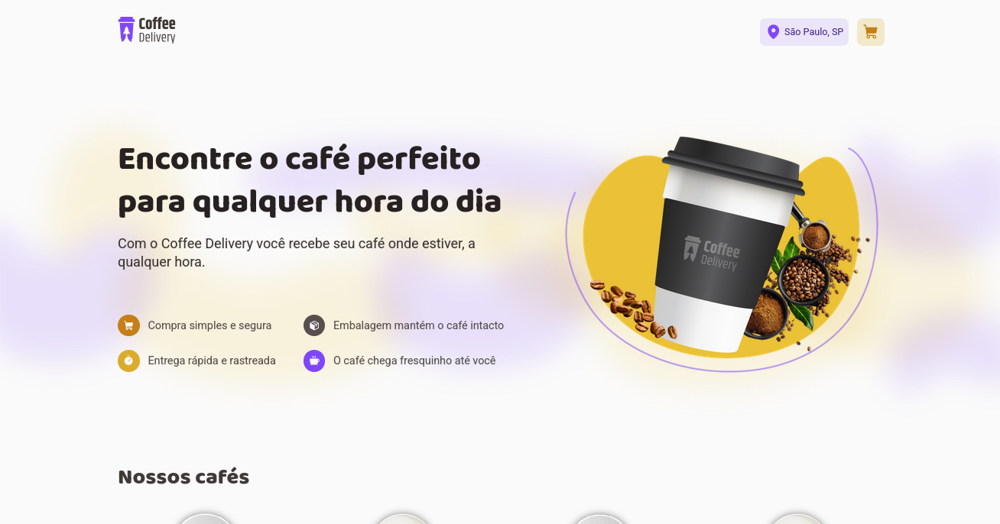
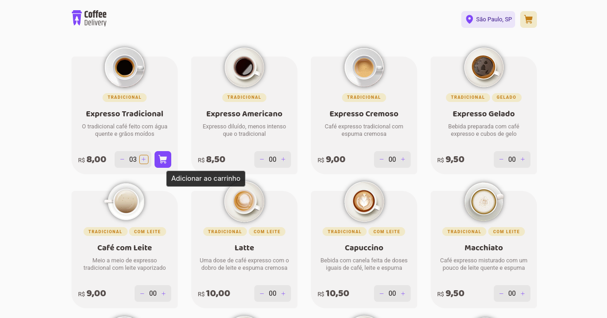
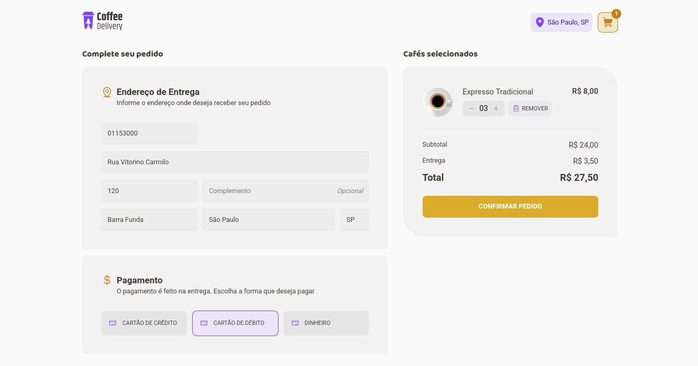
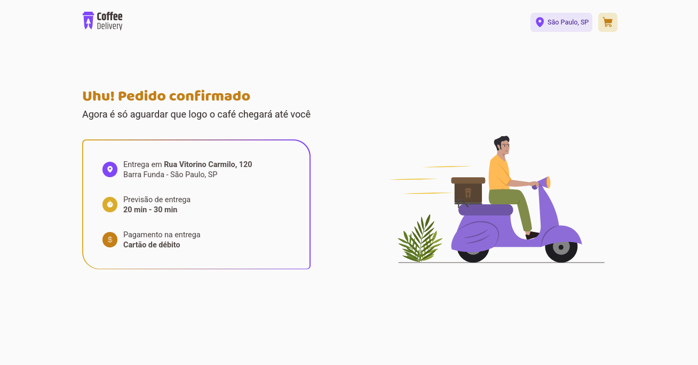

# ☕ Coffee Delivery

Projeto desenvolvido como parte do módulo **Aprofundando em Hooks** do curso **Ignite (2023)** da [Rocketseat](https://www.rocketseat.com.br/).  
O desafio consistia em construir um e-commerce fictício de uma cafeteria, a partir de um layout no Figma e uma lista de funcionalidades propostas.

## 📸 Preview

## 🚀 Tecnologias e Ferramentas

- **Vite** + **React.js** + **TypeScript**
- **Context API** + **useReducer** para gerenciamento de estado global
- **styled-components** para estilização
- **react-hook-form** + **zod** para validação de formulários
- **API ViaCEP** (autopreenchimento de endereço via CEP)
- **localStorage** para persistência do carrinho

## 💡 Funcionalidades

- Listagem de cafés disponíveis
- Sistema de carrinho com:
  - Adição e remoção de itens
  - Ajuste de quantidades
  - Cálculo automático de total
  - Persistência dos dados com `localStorage`
- Formulário de checkout com validação
- Escolha de forma de pagamento
- Feedback visual após confirmação do pedido
